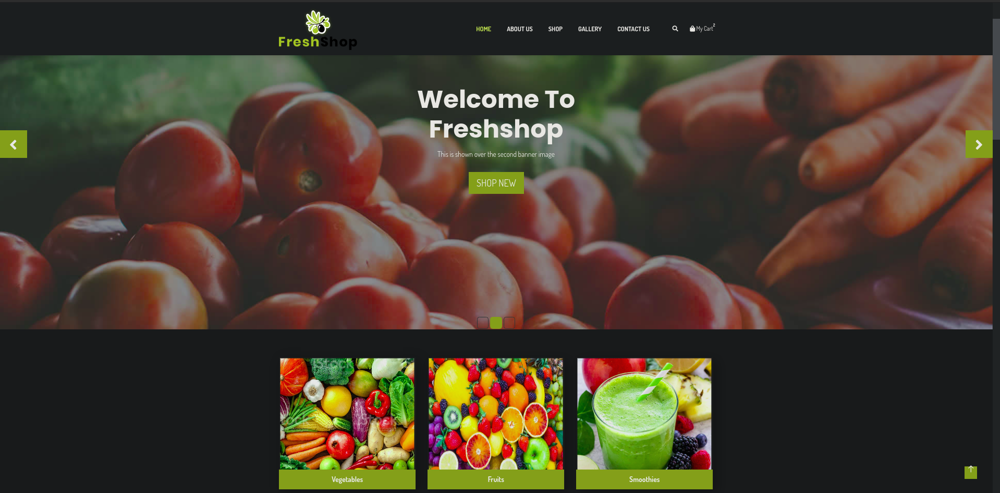
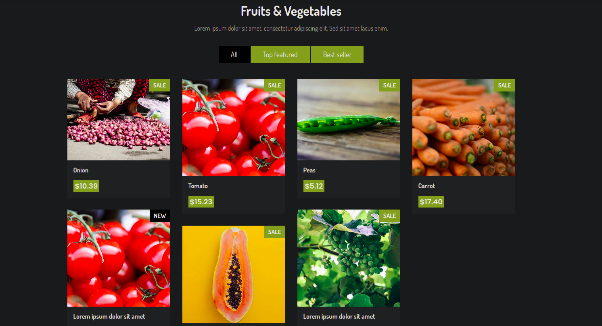
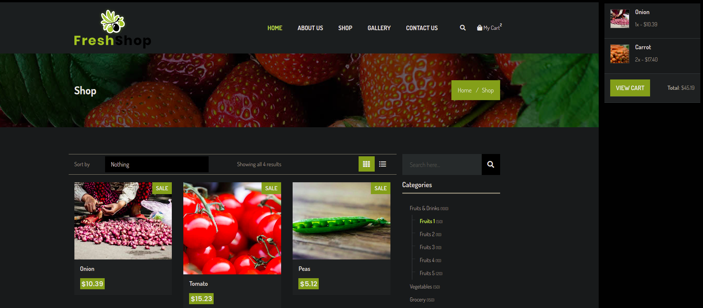
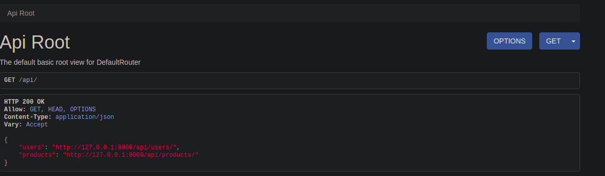
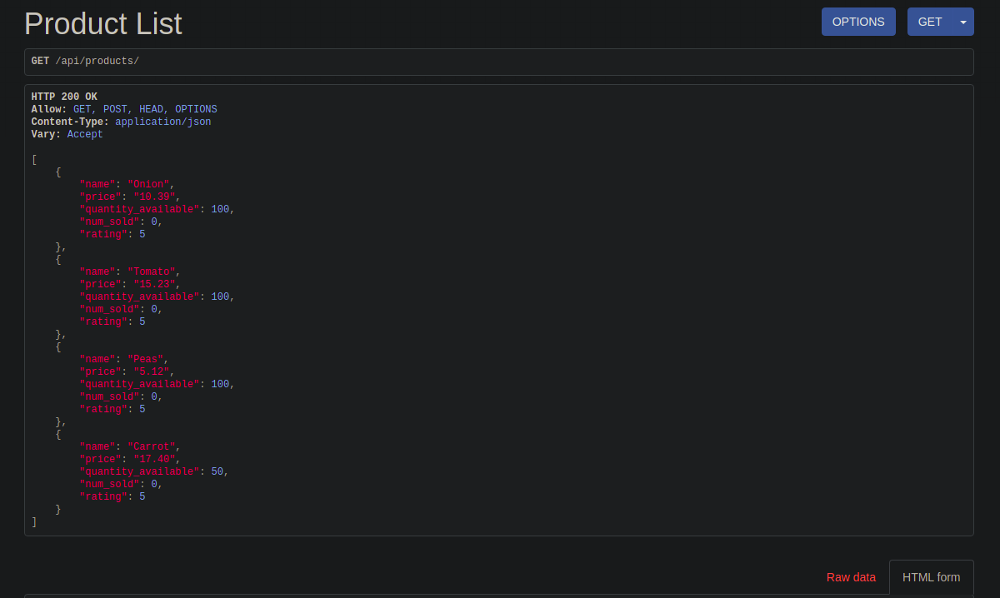

# my-app

## Table of Contents

- [About](#about)
- [Getting Started](#getting_started)
- [Usage](#usage)
- [Screenshots](#ss)
- [#TODO](#todo)

## About <a name = "about"></a>

Write about 1-2 paragraphs describing the purpose of your project.

## Getting Started <a name = "getting_started"></a>

These instructions will get you a copy of the project up and running on your local machine for development and testing purposes. See [deployment](#deployment) for notes on how to deploy the project on a live system.

### Prerequisites:

Clone the repository: 

```
git clone https://github.com/shadyskies/django-projects.git
```

### Installing:

Install the required python modules

```
pip3 install requirements.txt
```
Apply the intial migrations and then start the server.

```
python3 manage.py migrate
python3 manage.py runserver
```


## Usage <a name = "usage"></a>
```
cd ecom_website
python3 manage.py runserver
```
## Screenshots <a name = "ss"></a>







## TODO<a name = 'todo'>
- ~~implement base template for website~~
- ~~models for products~~
- ~~user access and profile route~~
- ~~cost and transaction handling~~
- ~~API (GET)~~
- deploy